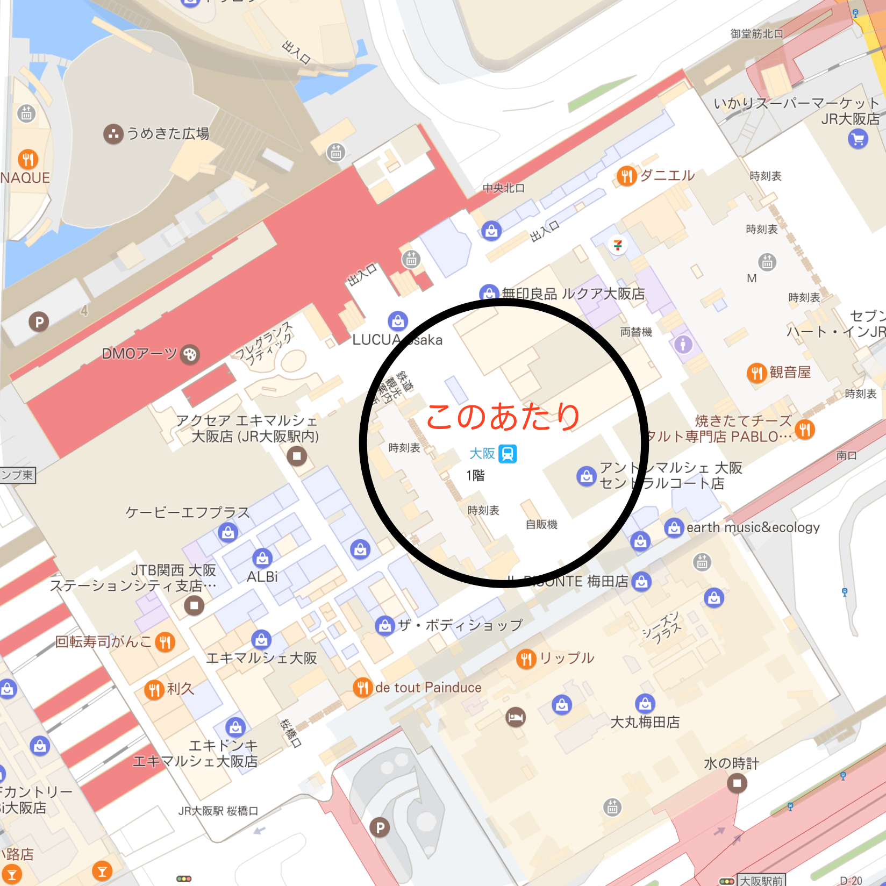
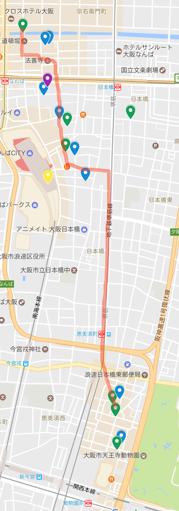

# 遠足のしおり
Version 0.1

## 目次
* [旅の心得](#旅の心得)
* [地図](#地図)
* [1日目](#1日目)
* [2日目](#2日目)
* [緊急連絡先](#緊急連絡先)
* [FAQ](#FAQ)

### 旅の心得
* せっかくの機会なので，何事に対しても恐れずに体験しましょう
* ステレオタイプなことはあまり期待しないようにしましょう
* 銃で打つフリをすればノッてくるというのは，TVが作り出した虚像だと思います
* 他所をディスることはやめましょう^[例：広島とかどこの田舎だよ]
* 頭髪をいじるのはやめましょう [^1]  

[^1]: 彡;,､､ﾐ  
 (=ﾟωﾟ)

### 地図
[google mapへ](https://drive.google.com/open?id=1RlBIeo359XcPZ0fA62Vll4z7eeg&usp=sharing)

### 1日目
* 11:13 新大阪着
* 在来線へ乗り換え
    + 11:22発(15番ホーム) -> 11:26 大阪駅着  
    + 11:24発(16番ホーム) -> 11:28 大阪駅着
* 11:30頃 りんちゃん，ピーコ出現
    + [中央改札にしましょう](#緊急連絡先)  
{width="30%"}
* 11:45 阪神百貨店でイカ焼きとミックスジュース^[イートスペースはないと思うので，持ち歩いてどっかで食べますかね]
* 12:00 昼ごはん＼(\^o\^)／ ^[混んでたら中止]
    + ネギ焼き食べますか？食べませんか？ピーコは食べます^[いつでも自由行動可]
        + 改めまして自己紹介^[ひとり20秒]
* 13:30 大阪冬の陣 ~中国人から大阪城を守ろう\~
    + あなたはJR派？地下鉄派？地下鉄なら初乗り3回以上で[1日乗車券](http://www.kotsu.city.osaka.lg.jp/general/eigyou/price/benri-joshaken/enjoy-eco.html)がお得
* 15:00 from なんば to 新世界  
    {width="30%"}
    +  こんなルートを考えてたり．
    + たこ焼きとか食ったりしますかね.
* 17:00 いい時間ですね．串カツ食べたりしますか？
* 19:00 すごくいい時間ですね．日本酒飲んでいいですか？
* 21:00 そろそろお宿に行きましょう．
* 23:00 おやすみなさい

### 2日目
* ピーコ二日酔い^[1日自由行動]
    + (\´；Д；\`)つ[google map](#地図)

### 緊急連絡先
Skypeがあるじゃろ．
LINEもあるじゃろ．

### FAQ(ファッキュー)
#### Q1:道に迷いました
A1: Google Mapを使いましょう．

#### Q2:Google Mapではわかりません
A2: 誰かに聞きましょう．同じ人間なので基本的に優しく教えてくれます．大阪だからといって，聞いてもないことまで教えてくるおばちゃんなんかはそうそういません．残念．間違えて中国人などに聞いても，気にしないようにしましょう．オススメは駅員さんだと思います．

#### Q3:値切りたいんだけど？
A3: きょうび，価格交渉なんてできません．

#### Q4:でも大阪でしょ？
A4: 関東資本のチェーン店がいくらでもあるんです．海外資本もあります．

#### Q5:本当にないの？
A5: そこまでしたいのなら，日本橋のJoshinならある程度できます．が，まぁ，プロレスみたいなもんです．
